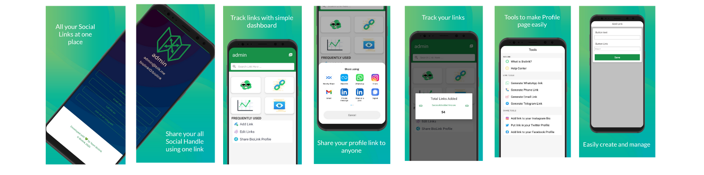

# Biolink

<h2> Multiple Links in a single URL</h2>

Instagram only gives you one link in bio. You can add multiple links for your Instagram Bio and optimise your Instagram traffic by using biolink.
Use your biolink Link as your business card , and display all your channels: Online Store, blogs, websites, other social media (fb, line, twitter, youtube, etc.), WhatsApp links, telephone links, chat line links and so on. 

# SCREENSHOTS

 

# -FEATURES-

### ONE BIO LINK & MULTIPLE LINKS
-Create a link with the biolink App that is cool and brandable. 
-Use it on Instagram and no need to change the link again.Offer multiple choices to your followers when they click on your Bio link.
-Share all your Social Media profiles and important links with just one url.
-Help your followers discover all of your recent content

### QUCIK &EASY TO USE
-Add your links and retrieve your unique URL. It literally takes 1 minute to get started.
-Open IG, go to "Edit your Instagram profile", paste your new URL and you're done.
-If you ever need to change your links, come back to biolink and edit them without the need to change your URL on your IG profile.

### MORE TRAFFIC 
-Add links in Instagram Bio, optimized landing page.
-Get valuable insights including clicks, pageviews.
-Share more than one social handle in one link (URL)
-Know exactly the power of one link having all links.

 
# AVAILABLE ON

    

