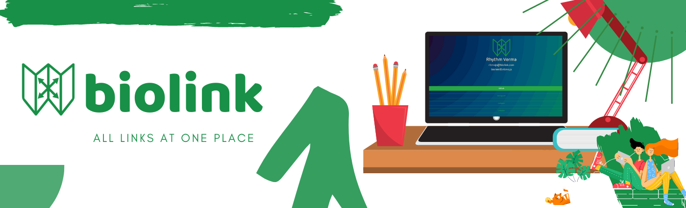
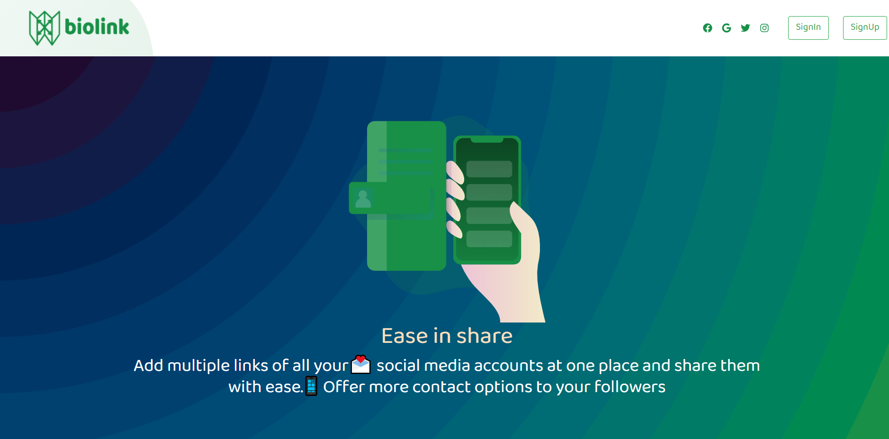
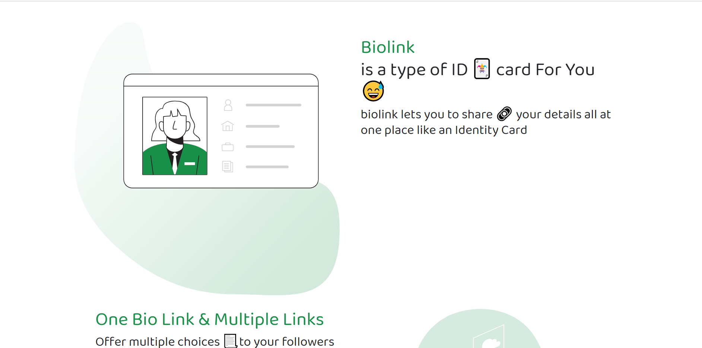
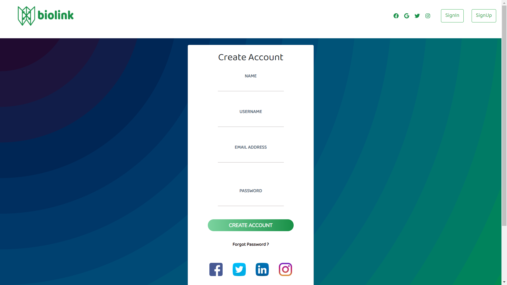
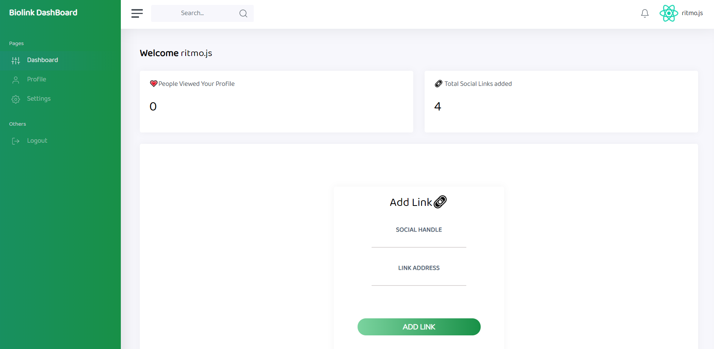

<p align="center">
  <a>
    
  </a>
</p>
<h1 align="center">
  biolink
</h1>

 
</p>

## What is Biolink?
* Add multiple links of all your💌 social media accounts at one place and share them with ease.📱 Offer more contact options to your followers


# How to Access Biolink?

* Visit https://biolink-ritmojs.herokuapp.com/


# ScreenShots









# How to Use Zest?

* Step-1: Visit https://biolink-ritmojs.herokuapp.com/
* Step-2: Click on the Signup Button (if you are new user or else just signin) .
* Step-3: Now you are on Signup Page ,Fill up the required details.
* Step-4: Click signup Button.
* Step-5: An alert with the successful message will appear.
* Step-6: Click on the Signin Link in the alert above.
* Step-7: Now Signin .
* Step-8: Now you are on your Dashboard ,here you can add Links and see the status of your previous added links.
* Step-9: Now after adding Links visit  https://biolink-ritmojs.herokuapp.com/
```bash
 yourbiolinkID 
```


# ThankYou 
<p align="center">

</p>

<h1 align="center">
   © biolink 2020
</h1>

